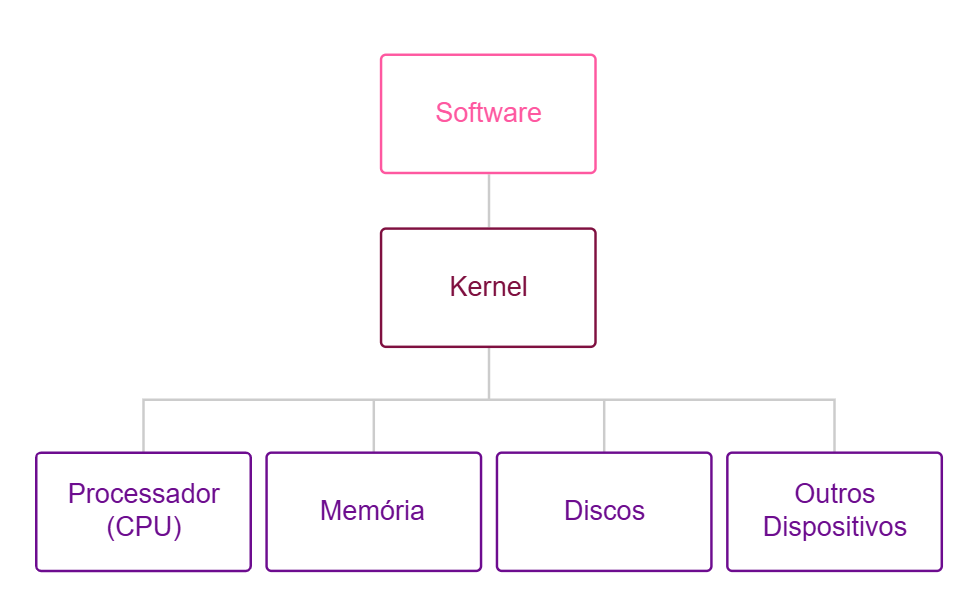
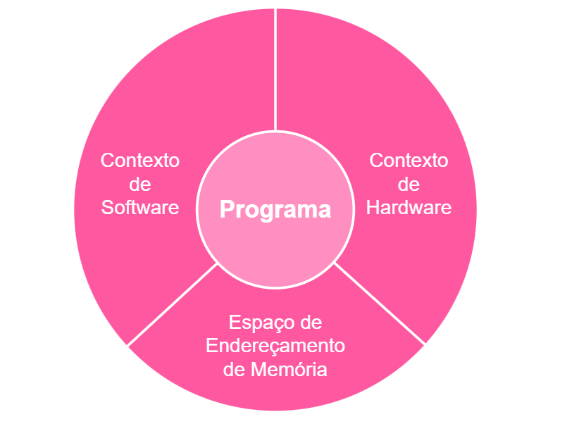
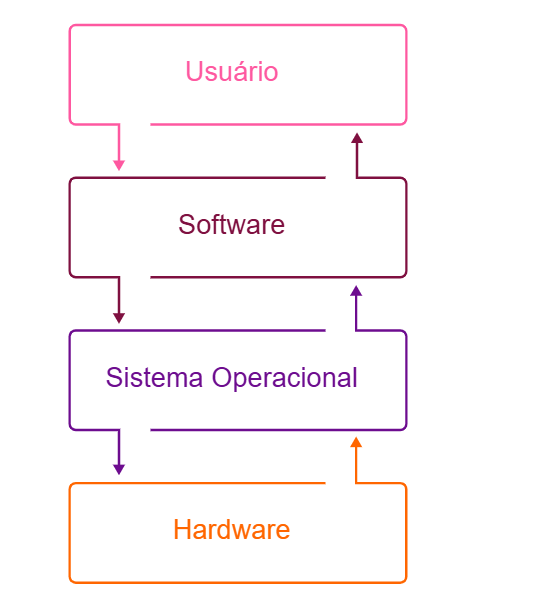

# 🖥️ Sistemas Operacionais: Fundamentos, Tipos e Aplicações  

## 🔍 1. Introdução aos Sistemas Operacionais  
Os sistemas operacionais (SO) são a **base** de qualquer sistema computacional, gerenciando recursos como **CPU 🧠, memória 💾, dispositivos de E/S ⌨️🖱️** e permitindo a execução de aplicativos. Eles atuam como **intermediários** entre o *hardware* e o *software*, garantindo eficiência, segurança e usabilidade.  

### 📚 Conceitos Básicos  
- **🐧 Kernel**: Núcleo do SO, responsável por gerenciar processos, memória e hardware. Opera em **modo privilegiado**.  
- **🔄 Processos e Threads**:  
  - **📦 Processo**: Programa em execução, com seu próprio espaço de memória.  
  - **🧵 Thread**: Unidade mínima de execução dentro de um processo.  
- **⏱️ Escalonamento**: Algoritmos que definem a ordem de execução dos processos (ex.: Round-Robin, FIFO).  

---

## 🏗️ 2. Tipos de Sistemas Operacionais  

### 🧱 Monolíticos  
- **✅ Todas as funções** (drivers, gerenciamento de memória) estão no **kernel**.  
- **👍 Vantagens**: Alto desempenho.  
- **👎 Desvantagens**: Falhas no kernel podem travar todo o sistema.  
- **🔧 Exemplos**: Linux tradicional, Windows 9x.  

### 🧩 Microkernels  
- **✅ Kernel mínimo** (apenas funções essenciais), com serviços rodando em **espaços isolados**.  
- **👍 Vantagens**: Maior segurança e modularidade.  
- **👎 Desvantagens**: Comunicação entre módulos pode reduzir desempenho.  
- **🔧 Exemplos**: QNX, MINIX.  

### ⚡ Híbridos  
- Combina **monolítico** (desempenho) e **microkernel** (segurança).  
- **🔧 Exemplos**: Windows NT/10/11, macOS (XNU), Linux moderno.  

| **Tipo**       | **Exemplos**          | **Uso Típico**          |  
|----------------|-----------------------|-------------------------|  
| 🧱 Monolítico  | Linux, UNIX           | Servidores, desktops    |  
| 🧩 Microkernel | QNX, MINIX            | Sistemas embarcados     |  
| ⚡ Híbrido     | Windows, macOS        | Desktops, workstations  |  

---

## 🧠 3. Gerenciamento de Memória  
### 📊 Técnicas Principais  
1. **📐 Segmentação**  
   - Divide a memória em **segmentos lógicos**.  
   - **✔️ Prós**: Flexibilidade.  
   - **❌ Contras**: Fragmentação.  

2. **📄 Paginação**  
   - Divide memória em **páginas fixas**.  
   - **✔️ Prós**: Menos fragmentação.  
   - **❌ Contras**: Overhead.  

3. **⚡ Híbrido**  
   - Usado em sistemas modernos (ex.: x86-64).  

---

## 💾 4. Sistemas de Arquivos  
| **Sistema** | **Criador**       | **Uso**                | **Destaques**          |  
|-------------|-------------------|------------------------|------------------------|  
| **FAT**     | Microsoft         | Pendrives              | Limite: 4GB            |  
| **NTFS**    | Microsoft         | Windows                | Criptografia 🔒        |  
| **Ext4**    | Linux             | Linux                  | Alta estabilidade 📊  |  
| **APFS**    | Apple             | macOS/iOS              | Otimizado para SSD 🚀  |  

---

## 🔌 5. Gerenciamento de Dispositivos  

- **🖨️ Drivers**: Software para comunicação com hardware.  
- **⚡ Plug-and-Play**: Configuração automática.  
- **🔧 Ferramentas**:  
  - Windows: `Gerenciador de Dispositivos`  
  - Linux: `lspci`, `lsusb`  

---

## 🌐 6. Sistemas Embarcados e IoT  
- **📟 SOs Leves**: FreeRTOS, Zephyr.  
- **🔋 Características**:  
  - Baixo consumo ⚡  
  - Tempo real ⏱️  
- **🏡 Aplicações**: Smart homes, wearables.  

---

## 🎯 Conclusão  
- **💻 Desktops/Servidores**: Linux, Windows, macOS.  
- **📱 Embarcados/IoT**: FreeRTOS, Zephyr.  
- **🧠 Memória/Arquivos**: Técnicas modernas garantem eficiência.  

**📚 Recomendado**:  
- TANENBAUM, A. *Sistemas Operacionais Modernos*.  
- SILBERSCHATZ, A. *Fundamentos de Sistemas Operacionais*.  