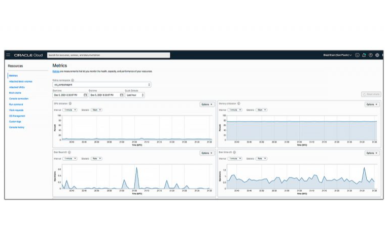
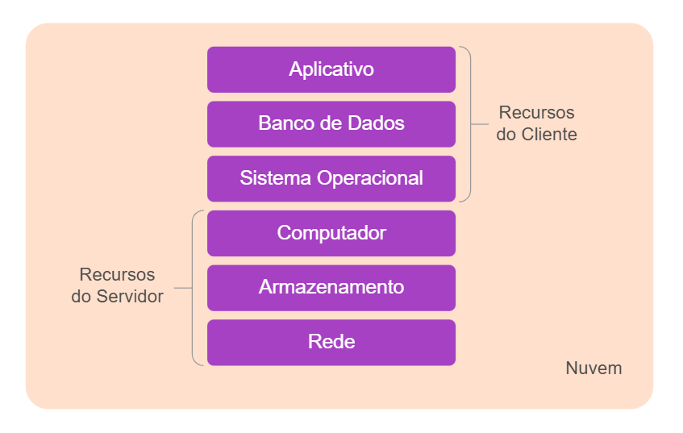

# ☁️ Computação em Nuvem  

**Modelo** que oferece:  
✔️ Acesso **ubíquo** (qualquer lugar/dispositivo)  
✔️ **Sob demanda** (recursos escaláveis)  
✔️ **Pool compartilhado** (servidores, armazenamento, redes)  
✔️ **Baixo custo** (pague apenas pelo uso)  

---

## 📌 Visão dos Especialistas  

### Elmasri e Navathe (2019)  
- **Serviços disponíveis**:  
  - 💻 Capacidade computacional  
  - 📁 Armazenamento em nuvem  
  - 🛠️ Softwares como serviço (SaaS)  
- **Vantagens**:  
  - ⚡ **Automatização** de provisionamento  
  - 💰 **Redução de custos** (TCO)  
  - 📈 **Escalabilidade** instantânea  

---

# 🌩️ Características Essenciais (NIST, 2011)  

1. **🌍 Acesso Ubíquo**  
   - Conecte-se de qualquer dispositivo (celular, notebook, etc.).  

2. **📊 Serviço Mensurável**  
   - Monitoramento transparente do consumo.  
   - *Exemplo*: Relatórios de uso de armazenamento.  

3. **⚡ Elasticidade Rápida**  
   - Aumente/diminua recursos **automaticamente**.  
   - *Caso real*: Lojas online durante promoções.  

4. **🔄 Pool de Recursos**  
   - Infraestrutura compartilhada entre clientes.  
   - Localização flexível (ex: datacenters globais).  

5. **🛒 Autosserviço Sob Demanda**  
   - Contrate serviços sem intervenção humana.  

---

# 🏢 Modelos de Implantação  

| Tipo          | 🔒 Segurança | 💵 Custo | Exemplo de Uso |  
|---------------|-------------|----------|----------------|  
| **Pública**   | Baixa       | Econômico | Startups       |  
| **Privada**   | Alta        | Alto      | Bancos         |  
| **Híbrida**   | Moderada    | Variável  | Empresas médias|  
| **Comunitária**| Alta       | Compartilhado | Governo     |  

---

### 📌 Destaques  
- **Nuvem privada local**: Infraestrutura física na empresa.  
- **Elasticidade**: Chave para otimizar custos.  

---

# Serviços de Numvem

São comercializados de varias maneiras diferentes!

## IAAS - Infrastructure as a Service

Quando falamos de IAAS coomo serviço de nuvem estamos falando de acesso a Rede, hardware e o armazenamento
e o cliente fornece todo o restande
Sofware, sistema de segurança e todo o ambiente

Ex: (Pizzaria)
Ela fornece o forno, o fogo e a estrutura para colocar a pizza para assar
Infraestrutura para ser ultilizada como serviço

## PAAS - Plataform as a Service

Plataforma como serviço é fornecido toda Rede, hardware, sistema de segurança, banco de dados
**Todo o ambiente / Infraestrutura**
E o cliente fornece apenas o modelo dele

Ex: (Pizzaria)
É fornecido o forno, o fogo e a estrutura para colocar a pizza mas agora temos a massa já pronta, as coisas para colocar na pizza tudo pronto simplismente para pegar a pizza, monta-la e assala

## SAAS - Software as a Service

Está tudo pronto para o cliente acessar a unica coisa que o cliente tem que fazer 
é uma ou outra configuração que temos dentor do ambiente

Ex: (Pizzaria)
O que é feito normalmente, vc vai na pizzaria, olha o cardapio e pede a pizza que vc quer
Não precisa saber que tem um forno ou todo o processo de criação

Saas já está tudo pronto e é só chegar e consumir o material

---

        Para Kavis (2014), existem três modelos principais de serviços em nuvem: infraestrutura como um serviço (IaaS), plataforma como um serviço (PaaS) e software como um serviço (SaaS).
      

<on-accordions>
        <on-accordion class="">

  <h3>Infraestrutura como um serviço</h3>
  

  
        

         É um tipo de computação em nuvem que permite alocar processamento, rede, armazenamento e recursos de segurança sob demanda. IaaS é uma camada base de pilha de serviços em nuvem. Ela serve como fundação para SaaS e PaaS.
      

      <on-figure description="IaaS" img="assets/private/on-image-iaas.svg"><figure>
  
  <figcaption style="width: 898px;">Fig. 4 - IaaS</figcaption>
</figure>

</on-figure>

      

        O servidor oferece ao cliente os recursos computacionais fundamentais, incluindo capacidade de armazenamento e rede onde o cliente pode implementar e executar sistemas operacionais, aplicativos e demais softwares.
      

      

        O cliente gerencia e controla o sistema operacional e aplicativos implementados por ele, mas não controla ou gerencia a infraestrutura fornecida pelo servidor.
      

        

</on-accordion>
        <on-accordion>

  <h3>Plataforma como um serviço</h3>
  

  
       

        É um modelo de computação em nuvem que proporciona aos clientes uma plataforma completa de hardware, software e infraestrutura, para desenvolvimento, execução e gerenciamento de aplicativos.
      

      <on-figure description="PaaS" img="assets/private/on-image-paas.svg"><figure>
  
  <figcaption style="width: 898px;">Fig. 5 - PaaS</figcaption>
</figure>

</on-figure>

      

        O cliente gerencia e controla os aplicativos implementados e, possivelmente, sobe as opções de configuração para o ambiente de hospedagem de aplicativos, mas não gerencia ou controla a infraestrutura em nuvem, incluindo a rede, os servidores, os sistemas operacionais ou armazenamento.
      

        

</on-accordion>
        <on-accordion>

  <h3>Software como um serviço</h3>
  

  
      

        É um modelo de computação em nuvem que proporciona aos clientes acesso a aplicativos executados na infraestrutura em nuvem por meio de um navegador web ou de uma interface de programa, como uma API, por exemplo.
      

      <on-figure description="SaaS" img="assets/private/on-image-saas.svg"><figure>
  
  <figcaption style="width: 898px;">Fig. 6 - SaaS</figcaption>
</figure>

</on-figure>

      

        O cliente não gerencia ou controla a infraestrutura em nuvem, incluindo rede, servidores, sistemas operacionais ou mesmo as capacidades de aplicativos individuais. Eventualmente, os clientes podem ter permissão para alterar algumas definições de configurações de aplicativos para personalizá-los.
      
          
        

</on-accordion>
      
</on-accordions>

        Dessa forma, poderíamos ter Autenticação como um Serviço (AaaS), Banco de Dados como um Serviço (DBaaS), Containers como um Serviço (CaaS), Armazenamento como um Serviço (STaaS), Funções como um Serviço (FaaS), Desktop como um Serviço (DaaS), Analítica como um Serviço (AaaS), além dos supracitados SaaS, PaaS e IaaS.
      

 Autenticação como um Serviço (AaaS), Banco de Dados como um Serviço (DBaaS), Containers como um Serviço (CaaS), Armazenamento como um Serviço (STaaS), Funções como um Serviço (FaaS), Desktop como um Serviço (DaaS), Analítica como um Serviço (AaaS)

SaaS, PaaS e IaaS.

